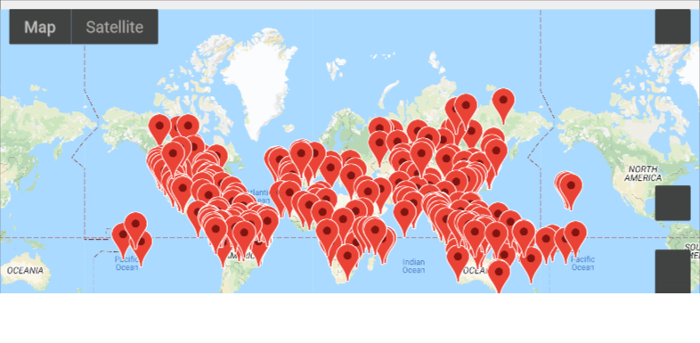
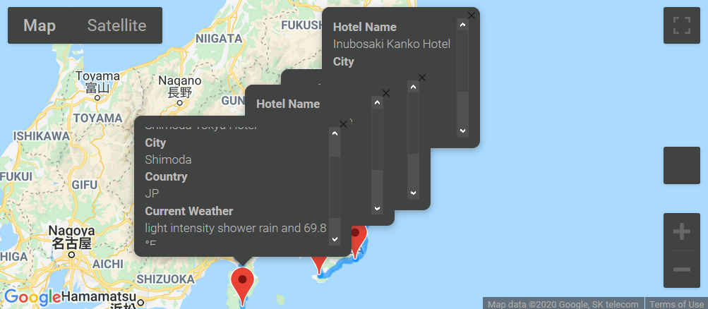
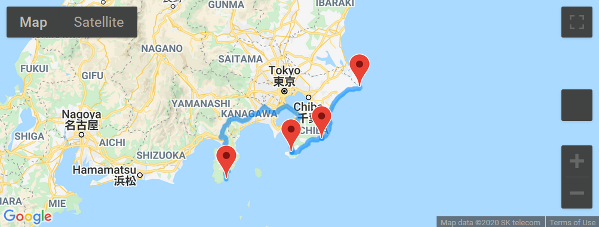

# World Weather Analysis for Vacation Planning

## Background

In this Python based app named "PlanMyTrip", weather data was added to a cities database to be shown with a click on a pop-up marker. Also the amount of rainfall or snowfall within the last three hours was added so that customers can filter the DataFrame using input statements based on the temperature range and whether or not it is raining or snowing. Finally, a directions layer is produced in Google map to show the directions between multiple cities for travel.

## Objectives:

- Create a DataFrame from an API search with weather parameters.
- Filter DataFrames based on input and nested decision statements, and logical expressions.
- Create pop-up markers on a Google map from a filtered DataFrame.
- Add a directions layer on a Google map between cities in the filtered DataFrame.

## Elements of the project:

1.- Create a random database of 1500 random latitudes and longitudes, get the weather description and amount of precipitation for each city.

2.- Ask for use input to narrow the travel search based on temperature and precipitation

  The user is prompted to enter the following information:
  - Minimum temperature preference.
  - Maximum temperature preference.
  - Preference on raining condition or not, using input("Do you want it to be raining? (yes/no) ").
  - Preference on snowing condition or not, using input("Do you want it to be snowing? (yes/no) ").
  
  Next, the filtered cities are added to a marker layer map with pop-up windows that include information on hotel name, city, country, current weather description. A screenshot of this map is shown below:

  And a pop-up window for each city look similar to the following image:

3.- Create a travel itinerary with a corresponding map

For this, four cities in close proximity were chosen as an example to create a directions layer map with a route connecting them.

